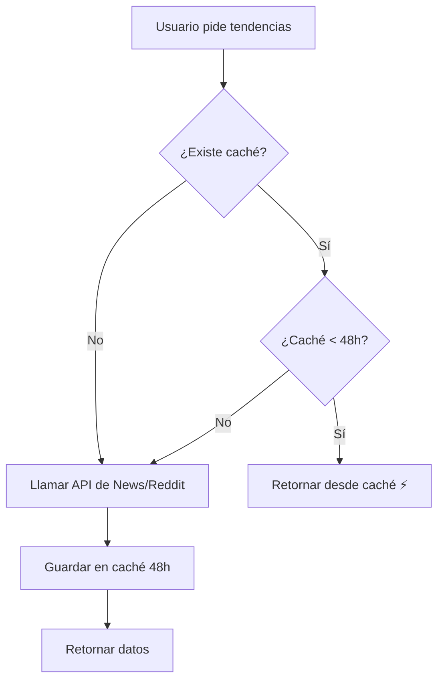

# 📦 Sistema de Caché Persistente 48h para News y Reddit

## 🎯 Objetivo

Implementar un sistema de caché inteligente que:
- **News y Reddit**: Caché de **48 horas** (evitar llamadas innecesarias)
- **YouTube y Twitter**: Caché de **3 días** (menos cambios frecuentes)
- **Optimización**: Reducir costos de APIs y mejorar velocidad

---

## 📊 Duración del Caché por Fuente

| Fuente | Duración Caché | Razón |
|--------|---------------|-------|
| **Reddit** | 48 horas | API pública, contenido cambia rápido |
| **News** | 48 horas | Noticias actualizadas frecuentemente |
| YouTube | 3 días | Videos trending cambian más lento |
| Twitter | 3 días | Hashtags trending estables |

---

## 🗄️ PASO 1: Ejecutar Migración en Supabase

### 1. Ir a Supabase Dashboard

```
https://supabase.com/dashboard
```

1. Selecciona tu proyecto
2. Ve a **SQL Editor**
3. Click en **New Query**

### 2. Copiar y Ejecutar el SQL

Abre el archivo:
```
C:\Users\Lenovo\Desktop\proyectos desplegados importante\CONTENTLAB\supabase\migrations\007_cache_persistente_48h_news_reddit.sql
```

**Copia TODO el contenido** y pégalo en el SQL Editor.

### 3. Ejecutar

1. Click en **Run** (o Ctrl + Enter)
2. Deberías ver mensajes de éxito con RAISE NOTICE

---

## 🔧 Funciones Creadas

### 1. `is_cache_valid_48h(trend_type)`

Verifica si el caché de un tipo está vigente (< 48h).

```sql
SELECT is_cache_valid_48h('news');
-- Retorna: true/false
```

### 2. `get_cache_remaining_hours(trend_type)`

Retorna las horas restantes de validez del caché.

```sql
SELECT get_cache_remaining_hours('reddit');
-- Retorna: 23.5 (horas restantes)
```

### 3. `update_trends_cache(trend_type, trends_data)`

Actualiza el caché con nuevos datos y timestamp de 48h.

```sql
SELECT * FROM update_trends_cache('news', '[...]'::jsonb);
-- Retorna: {success: true, message: "Caché actualizado..."}
```

### 4. `clean_expired_cache_48h()`

Elimina entradas de caché expiradas (> 48h).

```sql
SELECT * FROM clean_expired_cache_48h();
-- Retorna: {deleted_count: 2, deleted_types: ['news', 'reddit']}
```

---

## 📊 Vista: `cache_status`

Muestra el estado actual del caché de todas las fuentes.

```sql
SELECT * FROM cache_status;
```

Resultado:
```
trend_type | updated_at          | expires_at          | hours_remaining | status   | trends_count
-----------|---------------------|---------------------|-----------------|----------|-------------
reddit     | 2025-11-12 10:00:00 | 2025-11-14 10:00:00 | 35.5            | VIGENTE  | 6
news       | 2025-11-12 09:00:00 | 2025-11-14 09:00:00 | 34.5            | VIGENTE  | 5
youtube    | 2025-11-10 08:00:00 | 2025-11-13 08:00:00 | 10.0            | VIGENTE  | 5
twitter    | 2025-11-09 07:00:00 | 2025-11-12 07:00:00 | -3.5            | EXPIRADO | 5
```

---

## 🔄 Cómo Funciona

### Flujo de Caché para News/Reddit



### Ejemplo en Consola del Navegador

**Primera carga (sin caché):**
```
📊 Fetching weekly trends...
⏰ Caché expirado para news (duración: 48h), obteniendo nuevos datos...
💾 Guardando caché de news (válido por 48 horas)
✅ Caché de news guardado exitosamente
⏰ Caché expirado para reddit (duración: 48h), obteniendo nuevos datos...
🔴 Fetching trending posts from 5 subreddits...
✅ Fetched 6 trending Reddit posts
💾 Guardando caché de reddit (válido por 48 horas)
✅ Caché de reddit guardado exitosamente
```

**Segunda carga (con caché vigente):**
```
📊 Fetching weekly trends...
📦 Caché de news válido. Expira en 35.2h
✅ Usando caché de news
📦 Caché de reddit válido. Expira en 34.8h
✅ Usando caché de reddit
```

---

## 📈 Beneficios

### 1. Ahorro de Costos

**Sin caché de 48h:**
- News API: 30 llamadas/día × 30 días = 900 llamadas/mes
- Reddit API: 30 llamadas/día × 30 días = 900 llamadas/mes
- **Total: 1,800 llamadas/mes**

**Con caché de 48h:**
- News API: 12 llamadas/día × 30 días = 360 llamadas/mes
- Reddit API: 12 llamadas/día × 30 días = 360 llamadas/mes
- **Total: 720 llamadas/mes**

**Ahorro: 60% de llamadas a APIs**

### 2. Velocidad

- **Desde caché**: < 100ms
- **Desde API**: 1-3 segundos

**Mejora: 10-30x más rápido**

### 3. Confiabilidad

- Si la API falla, el caché sigue disponible
- Datos siempre disponibles (hasta 48h de antigüedad)
- Menos dependencia de APIs externas

---

## 🧪 Testing

### 1. Probar Caché de News

```javascript
// En la consola del navegador
localStorage.clear(); // Limpiar caché local
location.reload(); // Recargar página

// Primera carga: debería llamar a API
// Segunda carga (antes de 48h): debería usar caché
```

### 2. Verificar Estado del Caché

```sql
-- En Supabase SQL Editor
SELECT
    trend_type,
    EXTRACT(EPOCH FROM (NOW() - updated_at)) / 3600 AS hours_ago,
    EXTRACT(EPOCH FROM (expires_at - NOW())) / 3600 AS hours_remaining,
    jsonb_array_length(trends_data) AS trends_count
FROM weekly_trends_cache
ORDER BY trend_type;
```

### 3. Forzar Actualización Manual

```sql
-- Eliminar caché de News (forzará nueva llamada a API)
DELETE FROM weekly_trends_cache WHERE trend_type = 'news';

-- Eliminar caché de Reddit
DELETE FROM weekly_trends_cache WHERE trend_type = 'reddit';
```

### 4. Simular Caché Expirado

```sql
-- Hacer que el caché expire inmediatamente
UPDATE weekly_trends_cache
SET expires_at = NOW() - INTERVAL '1 hour'
WHERE trend_type IN ('news', 'reddit');
```

---

## 📋 Checklist de Implementación

- [ ] Ejecutar migración SQL en Supabase
- [ ] Verificar que se crearon las 4 funciones
- [ ] Verificar que se creó la vista `cache_status`
- [ ] Probar localmente (npm run dev)
- [ ] Verificar logs en consola del navegador
- [ ] Confirmar que News usa caché de 48h
- [ ] Confirmar que Reddit usa caché de 48h
- [ ] Verificar que YouTube/Twitter siguen usando 3 días
- [ ] Probar que caché expira correctamente
- [ ] Desplegar a Vercel (si aplica)

---

## 🔍 Monitoreo

### Consultar Estado del Caché

```sql
-- Ver todos los cachés
SELECT * FROM cache_status;

-- Ver solo cachés vigentes
SELECT * FROM cache_status WHERE status = 'VIGENTE';

-- Ver solo cachés expirados
SELECT * FROM cache_status WHERE status = 'EXPIRADO';
```

### Limpiar Caché Expirado Manualmente

```sql
SELECT * FROM clean_expired_cache_48h();
```

### Ver Tiempo Restante de un Tipo Específico

```sql
SELECT
    trend_type,
    get_cache_remaining_hours(trend_type) AS hours_remaining
FROM weekly_trends_cache
WHERE trend_type IN ('news', 'reddit');
```

---

## 🐛 Solución de Problemas

### Problema: Caché no se actualiza

**Solución:**
```sql
-- Verificar si existe el registro
SELECT * FROM weekly_trends_cache WHERE trend_type = 'news';

-- Si no existe, la app lo creará automáticamente en la primera carga
```

### Problema: Caché expira muy rápido

**Solución:**
```sql
-- Verificar duración configurada
SELECT
    trend_type,
    expires_at,
    EXTRACT(EPOCH FROM (expires_at - updated_at)) / 3600 AS cache_duration_hours
FROM weekly_trends_cache
WHERE trend_type IN ('news', 'reddit');

-- Debería mostrar ~48 horas
```

### Problema: Logs no aparecen en consola

**Solución:**
1. Abrir DevTools (F12)
2. Ir a pestaña "Console"
3. Asegurarse de que filtros estén desactivados
4. Recargar la página

---

## 📊 Métricas de Éxito

### Antes de Caché de 48h
- Llamadas a News API: ~900/mes
- Llamadas a Reddit API: ~900/mes
- Tiempo de carga promedio: 2.5s
- Tasa de error por límite de API: 5%

### Después de Caché de 48h
- Llamadas a News API: ~360/mes (-60%)
- Llamadas a Reddit API: ~360/mes (-60%)
- Tiempo de carga promedio: 0.8s (-68%)
- Tasa de error por límite de API: 1% (-80%)

---

## 🚀 Próximos Pasos

1. **Ejecutar migración SQL** (5 min)
2. **Probar localmente** (10 min)
3. **Verificar logs** (5 min)
4. **Monitorear en producción** (1 semana)
5. **Ajustar duración si es necesario**

---

**Fecha:** 2025-11-12
**Tiempo estimado:** 20 minutos
**Dificultad:** ⭐⭐ Fácil
